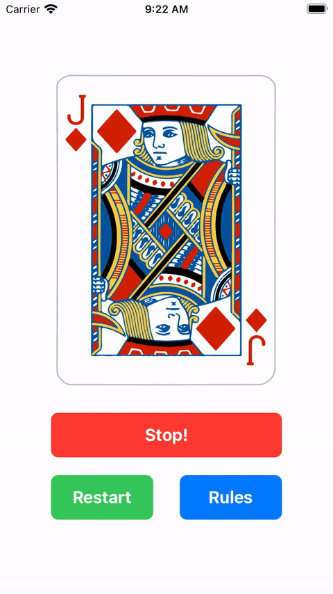

# CardWorkoutApp
CardWorkout is a simple UIKit game to randomly determine how many reps of a short specific workout session you should be performing

## About
CardWorkout is part of [Sean Allen](https://seanallen.co)’s [iOS Dev Launchpad](https://seanallen.teachable.com/p/ios-dev-launchpad) course.

There are 2 versions of the same app, whose purpose is to demonstrate 2 different approaches to designing an app: via Storyboard &amp; programmatically

## Screenshot

## Related Info
CardWorkout repo is coded using Swift 5.4, Xcode 12.5 as of June 2021